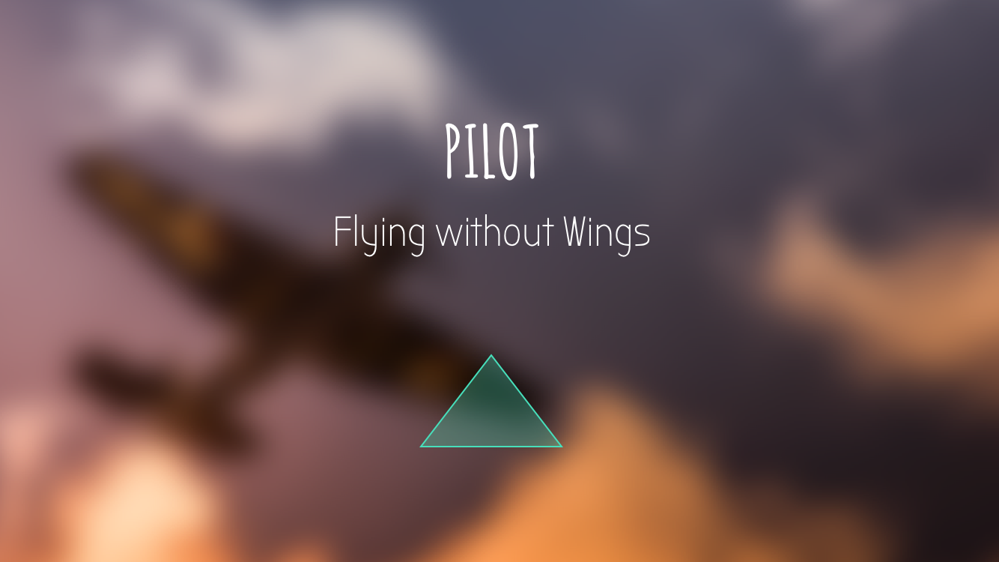

# PILOT

## Description

PILOT is an iOS appilication, providing wonderful virtual experience from a pilot's view. To use this app, you need to have a VR device and a unmanned aerial vehicle as well. The video in the VR device is real-time, and it will change with the movement of your head.

## HOW TO USE PILOT

- Get your iPhone linked to an unmanned aerial vehicle.
- Put your iPhone in a cardboard. 
- Launch the UAV.
- Put on your cardboard.
- Try to move your head forward and back, right and left, and just enjoy this awesome virtual experience!  

## Use SDK

### DJI Mobile SDK

## About UP

UP Team is a Geek Team, whose members are from different places. We like to create ideas and make them come true. So fly without wings, hack everything for every dreams. 

## The MIT License (MIT)

Copyright (c) 2016 HackxFdu-UP

Permission is hereby granted, free of charge, to any person obtaining a copy of this software and associated documentation files (the "Software"), to deal in the Software without restriction, including without limitation the rights to use, copy, modify, merge, publish, distribute, sublicense, and/or sell copies of the Software, and to permit persons to whom the Software is furnished to do so, subject to the following conditions:

The above copyright notice and this permission notice shall be included in all copies or substantial portions of the Software.
